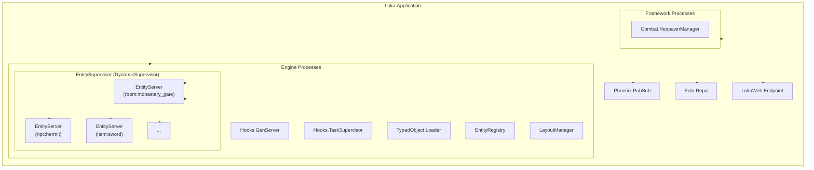
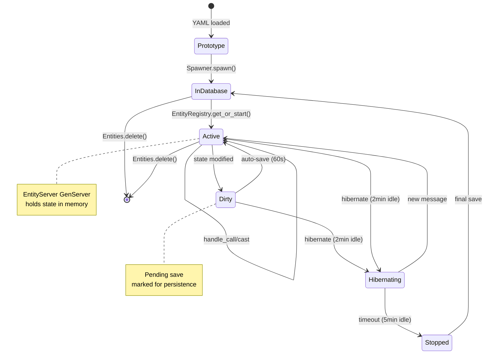
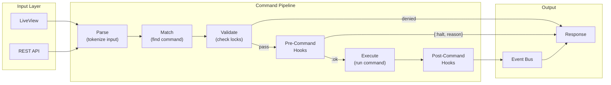
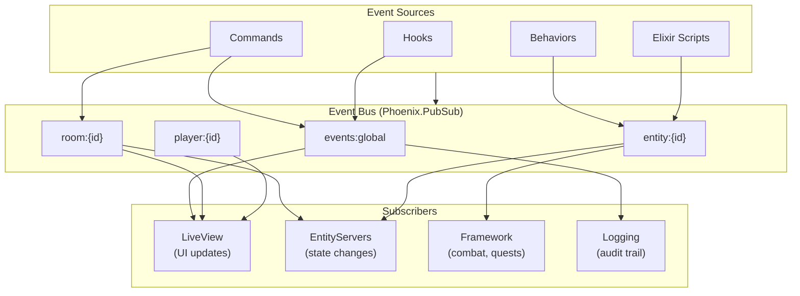
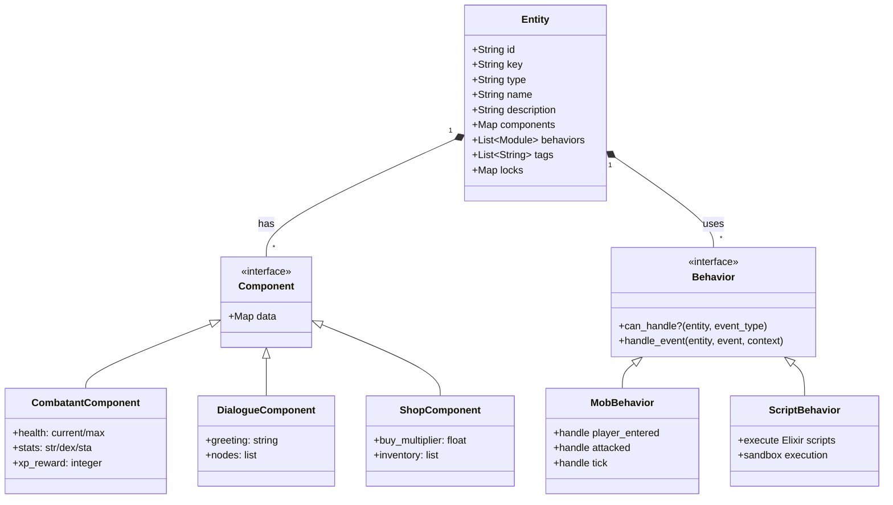
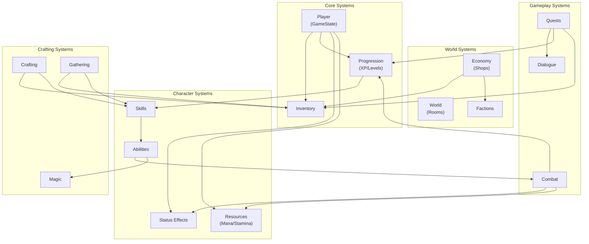
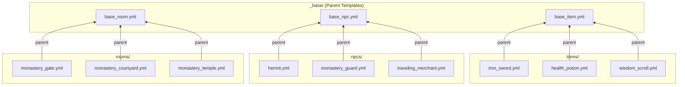
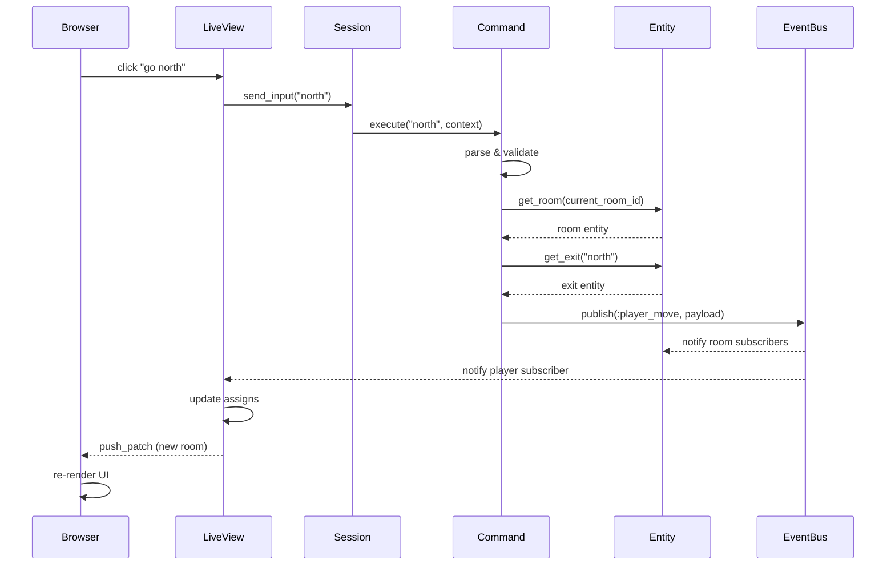

# Architecture Diagrams

Visual diagrams of Loka's core architecture using Mermaid.

## Supervision Tree

The OTP supervision tree showing process hierarchy and fault tolerance boundaries.



## Entity Lifecycle

State machine showing how entities transition through their lifecycle.



## Command Pipeline

Flow of a player command from input to execution.



## Event Flow

How events propagate through the system.



## Entity-Component-Behavior Model

How entities are composed from components and behaviors.



## Framework Subsystem Relationships

How the 27 framework subsystems interact.



## Database Schema

Entity-Attribute-Value storage pattern.

```mermaid
erDiagram
    ENTITIES {
        uuid id PK
        string key UK
        string type
        string name
        text description
        json components
        json tags
        json locks
        uuid location_id FK
        datetime inserted_at
        datetime updated_at
    }

    ENTITY_ATTRIBUTES {
        uuid id PK
        uuid entity_id FK
        string key
        string value_type
        text value
        datetime inserted_at
        datetime updated_at
    }

    SCRIPTS {
        uuid id PK
        string name UK
        string script_type
        text code
        json metadata
        datetime inserted_at
        datetime updated_at
    }

    PLAYERS {
        uuid id PK
        string email UK
        binary hashed_password
        boolean is_admin
        datetime confirmed_at
        datetime inserted_at
        datetime updated_at
    }

    GAME_STATES {
        uuid id PK
        uuid player_id FK UK
        json inventory
        json equipment
        json quests
        json flags
        json stats
        json health
        string current_room_id
        datetime inserted_at
        datetime updated_at
    }

    ENTITIES ||--o{ ENTITY_ATTRIBUTES : has
    ENTITIES ||--o| ENTITIES : "location (room)"
    PLAYERS ||--|| GAME_STATES : has
```

## Prototype Inheritance

How YAML prototypes inherit from parent templates.



## Request Flow (LiveView)

How a player action flows through the system.



## Related

- [Entity System](./entity-system.md) - Detailed ECB documentation
- [Entity Lifecycle](./entity-lifecycle.md) - Process management details
- [Commands](./commands.md) - Command pipeline implementation
- [Events](./events.md) - Event bus patterns
- [Prototypes](./prototypes.md) - YAML template system
